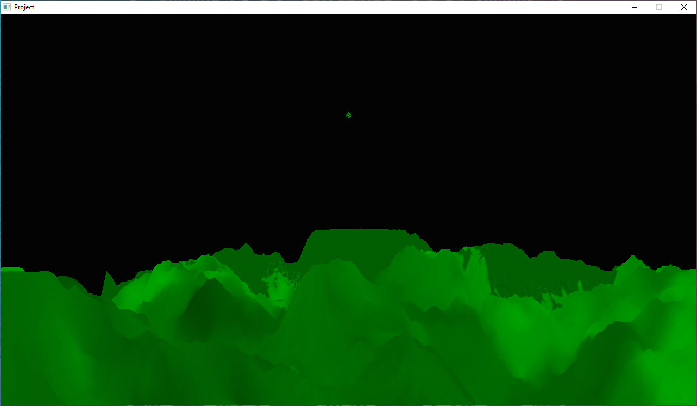
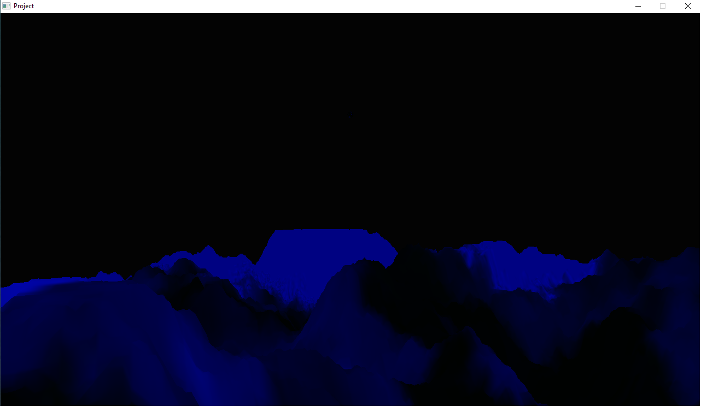
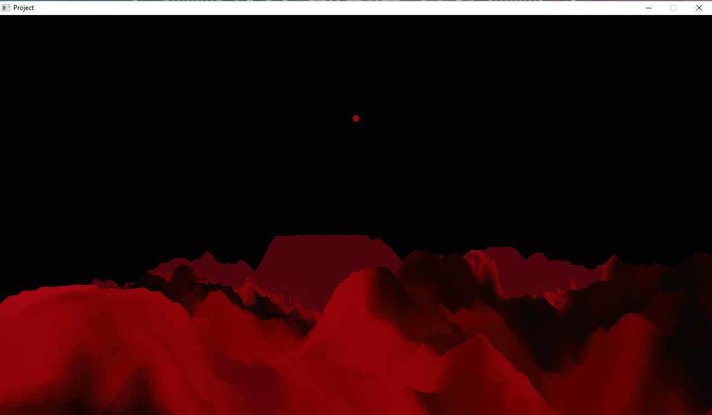
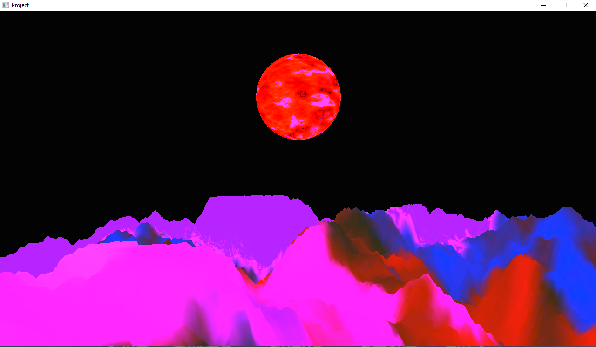
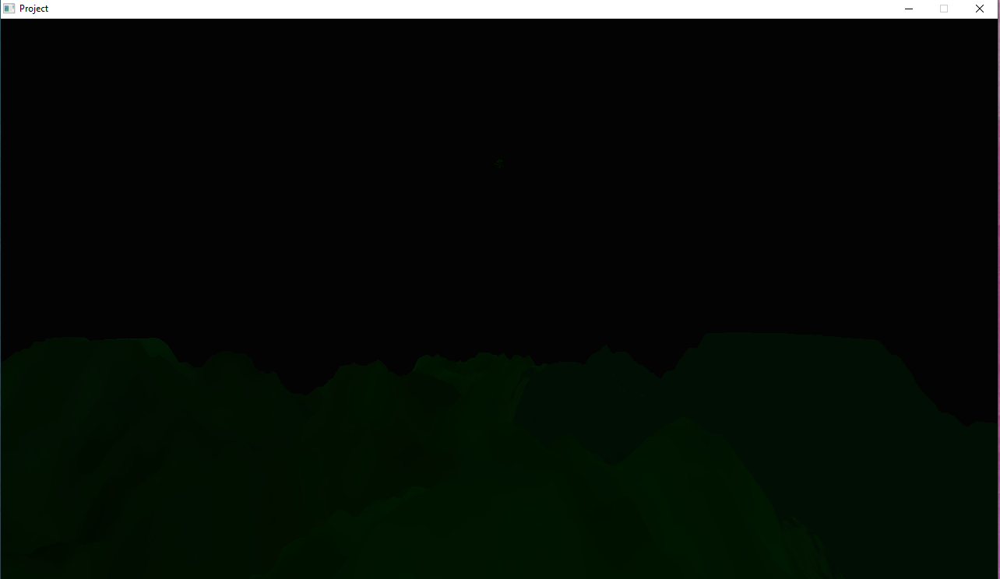

## **Music Scene** - Audio-Based Object and Terrain Rendering
What if the *world* was our audio visualizer? This project aims to create an immersive multimedia experience in which objects in a three-dimensional world are rendered with intention, taking audio data into account when calculating transformations and lighting for each frame.

## **Demo**: 
[CS 5310 | Summer I 2023 | Final Project](https://youtu.be/Tc22eTMhvOU)

Slight recording delays in playback.

### Screenshots
#### Base Color: Green (Default)

#### Base Color: Blue

#### Base Color: Red

#### At Higher Amplitudes (w/ Green Base Color)

#### Near End (Dim)


## Key Features
- Creates SceneGraph where `Terrain` is the root and the sun (`Sphere`) is a child of the root.
- Uses a TBN matrix in shaders.
- Decodes `.wav` audio files, using amplitide for node transformations and progress (percentage of file already played) for both transformations and lighting.
- Amplitude is used to scale the sun in the scene at each frame, such that the sun appears larger when the music is louder and smaller when the music is quieter. Scaling is bounded so the sun appears neither too large nor too small.
- Amplitude is also used to determine the color of the scene. The base color (most prominent color at low amplitudes) can be changed via `R` (red), `G` (green), and `B` blue keys.
- The progress value is applied such that the scene gradually fades and completes exactly one full rotation by end of audio playback.

## Running & Interaction
To run the program, provide a relative path to a `.wav` file as the second argument. Some samples can be found in the `/media` directory.
```
./project "./media/see_you_again.wav"
./project "./media/hackbeanpot-2022.wav"
./project "./media/hackbeanpot-2022-short.wav"
```
<table>
  <tbody>
    <tr>
      <th>Key/Gesture</th>
      <th>Behavior</th>
    </tr>
    <tr>
      <td>R/G/B</td>
      <td>Change the base color: the dominant color at low amplitudes (i.e. when little to no sound is heard). By default, the base color is green (G).</td>
    </tr>
    <tr>
      <td>Mouse Motion</td>
      <td>Moves camera. At the beginning of the program, the camera is placed at the edge of the terrain, looking toward the center of the terrain. This perspective can be changed via mouse motion.</td>
    </tr>
    <tr>
      <td>Up Arrow</td>
      <td>Move Forward</td>
    </tr>
    <tr>
      <td>Down Arrow</td>
      <td>Move Backward</td>
    </tr>
    <tr>
      <td>Left Arrow</td>
      <td>Move Left</td>
    </tr>
    <tr>
      <td>Right Arrow</td>
      <td>Move Right</td>
    </tr>
    <tr>
      <td>Page Up</td>
      <td>Move Up</td>
    </tr>
    <tr>
      <td>Page Down</td>
      <td>Move Down</td>
    </tr>
    <tr>
      <td>Window/Application Exit Button</td>
      <td>The program is designed to close automatically after completing playback of the given audio file, but can be closed manually using the exit button on the `Project` window.</td>
    </tr>
  </tbody>
</table>

## External Resources
  * [miniaudio](https://github.com/mackron/miniaudio): audio playback library. This library was used to play the given audio (`.wav`) file while the program uses its data to render a scene.
  * [dr_libs](https://github.com/mackron/dr_libs): audio decoding library. The `dr_wav` library, specifically, was used to decode the given `.wav` file, specifically in retrieving the amplitude at each moment in the audio and calculating the progress made (percentage of the audio elapsed) based on the overall length of the the file. Both `amplitude` and `progress` were used to render each frame.
